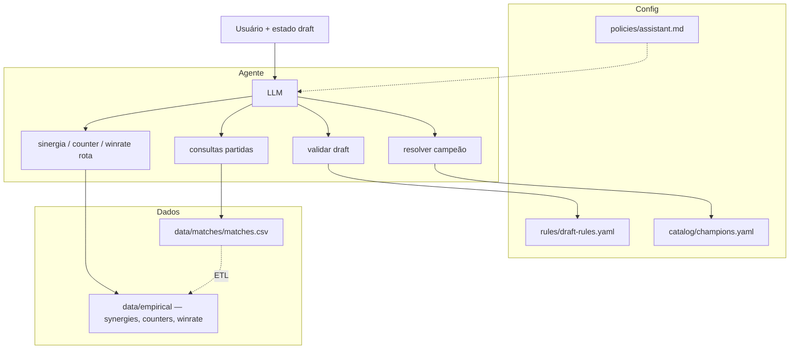
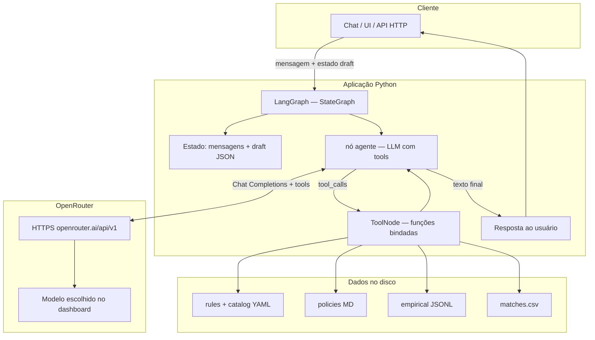
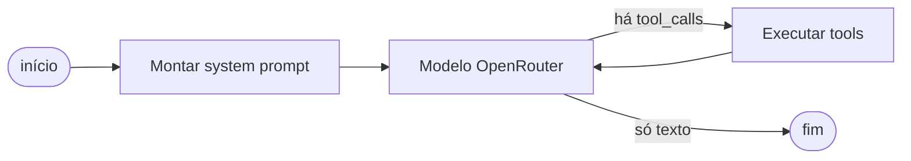

# Especificação do agente (implementação)

Documento único para montar o orquestrador, tools e dados. **Atualize os diagramas** quando a arquitetura mudar.

## Diagrama lógico (camadas)



## Arquitetura com tecnologias — LangGraph + OpenRouter

Visão de **runtime** sugerida: orquestração em **LangGraph** (Python), modelo via **OpenRouter** (API compatível com OpenAI), tools em Python lendo arquivos do repositório.



### Fluxo do grafo (loop agente ↔ tools)



## Fluxo

1. Entrada: mensagem + **estado do draft** (JSON normalizado).
2. Prompt: políticas (`policies/assistant.md`) + trecho compacto das regras (`rules/draft-rules.yaml`).
3. Tools: validação e nomes contra YAML/catálogo; estatísticas e partidas **só via tool** (não carregar JSON/CSV inteiro no prompt).

## Estado do draft (contrato sugerido)

```json
{
  "format_id": "ranked_solo_draft",
  "current_step_index": 0,
  "side_perspective": "blue",
  "bans": [],
  "picks_blue": [],
  "picks_red": []
}
```

`current_step_index` = ações **já concluídas** (0 … **20** para ranqueado: 20 steps). Próxima jogada = `steps[current_step_index]` se `< 20`. Fases: `phases[].step_range`.

---

## Camada 1 — Config

| Caminho | Uso |
|--------|-----|
| `rules/draft-rules.yaml` | Mecânica do draft; validação determinística (fases, bans/picks, roles). |
| `policies/assistant.md` | Comportamento, limites (ex.: não inventar winrate), tom. |
| `catalog/champions.yaml` | Nomes/ids/aliases alinhados a dados e ETL. |

---

## Camada 2 — Agregados

### Sinergia e counter

**Arquivos:** `data/empirical/synergies.jsonl`, `data/empirical/counters.jsonl`.

**Linha:** `champion1`, `champion2`, `winrate`, `games`.

**Semântica:** alinhar à descrição da tool e ao ETL — mesmos campos nos dois arquivos; ordem pode importar no counter.

### Winrate por campeão e rota

**Arquivo:** `data/empirical/winrate.jsonl`.

**Linha:** `champion`, `lane`, `winrate`, `games` — `lane` em {`top`, `jungle`, `mid`, `bottom`, `support`} (conferir valores reais no export).

**Tool sugerida:** `empirical_lane_winrate` — `champion`, opcional `lane`, `min_games`; retorna linhas desse campeão para o draft sugerir rota com mais amostra.

**Regras gerais (Camada 2)**

- Consultas com `min_games` (ex.: ≥10) onde fizer sentido.
- Resposta estruturada com `games` e `winrate` para o modelo citar a amostra.

**Tools (sinergia / counter)**

| Tool | Parâmetros | Retorno |
|------|------------|---------|
| `empirical_synergy` | `champion`, `min_games`, `top_k` | Pares no mesmo time. |
| `empirical_counter` | `champion`, `min_games`, `top_k` | Métrica de “counter” do ETL. |
| `empirical_pair` | `champion_a`, `champion_b`, `relation` | Um par, se existir. |

**Metadados do export (recomendado):** `generated_at`, `source`, opcional `min_games_used_in_export`.

---

## Camada 3 — Partidas (uma linha = um jogo)

**Arquivo no repositório:** `data/matches/matches.csv`.

**Colunas (ordem):**

`gameid,top_blue,jng_blue,mid_blue,bot_blue,sup_blue,top_red,jng_red,mid_red,bot_red,sup_red,result`

- `result`: `1` = vitória do **azul**; `0` = vitória do **vermelho**.

**Tools:** consultas **parametrizadas** (evitar SQL livre do LLM), ex.:

- composição exata (5 campeões + lado + opcional vitória);
- vitória do lado que contém campeão X em rota Y (ou qualquer rota);
- amostra limitada de partidas.

Devolver sempre **contagens** (e período/torneio do dataset, quando existir).

**Armazenamento:** CSV; depois SQLite/Postgres ou tabela normalizada `match_participant` se precisar de performance.

---

## Tools (visão única)

| Tool | Fonte |
|------|--------|
| `validate_draft_state` | `rules/draft-rules.yaml` |
| `resolve_champion` | `catalog/champions.yaml` |
| `empirical_synergy` / `empirical_counter` / `empirical_pair` | `data/empirical/*.jsonl` (sinergia/counter) |
| `empirical_lane_winrate` | `data/empirical/winrate.jsonl` |
| `matches_*` (parametrizadas) | `data/matches/matches.csv` |

---

## ETL

`data/matches/matches.csv` → job batch → `synergies.jsonl`, `counters.jsonl`, `winrate.jsonl` (versionados). Em runtime o agente lê agregados via tools e comps via Camada 3.

## Datasets grandes

Git LFS, release ou path ignorado; documentar onde obter o arquivo.
