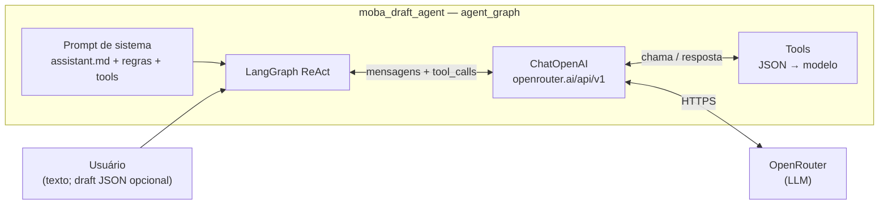
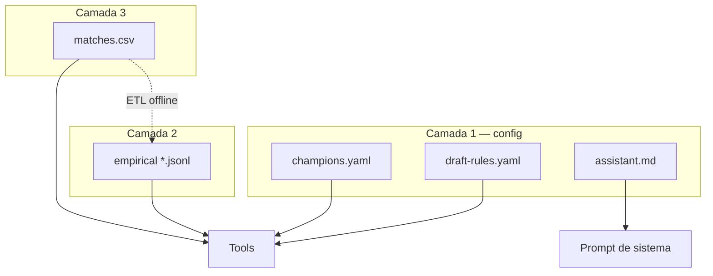

# Agente — dados e runtime

LLM via **OpenRouter**, orquestração **LangGraph** (ReAct). Tools em Python leem arquivos no repositório; **não** enviar JSON/CSV inteiros no prompt — só o retorno das tools.

## Diagramas

### 1) Fluxo principal

Da esquerda para a direita: **usuário → orquestração → API → modelo**. O laço **ChatOpenAI ↔ Tools** continua enquanto o modelo pedir ferramentas.



**Baseline (sem grafo):** `draft_assistant_reply` / `openrouter_chat_completion` — uma chamada direta à mesma API, **sem** tools.

### 2) Arquivos no disco → quem usa



Os nós **Prompt** e **Tools** são os mesmos do diagrama 1; aqui só se vê **de onde vêm** regras, nomes, políticas e números.

## Estado do draft (JSON)

`current_step_index` = número de ações **já concluídas** (0 … N, com N = `len(steps)`). Próxima ação: `steps[current_step_index]` se `index < N`.

```json
{
  "format_id": "ranked_solo_draft",
  "current_step_index": 0,
  "side_perspective": "blue",
  "bans": [],
  "picks_blue": [],
  "picks_red": []
}
```

## Config (Camada 1)

| Arquivo | Uso |
|---------|-----|
| `rules/draft-rules.yaml` | Ordem do draft, validação determinística |
| `policies/assistant.md` | System prompt — tom e limites |
| `catalog/champions.yaml` | ids, nomes, aliases |

## Empírico (Camada 2)

Arquivos: `data/empirical/synergies.jsonl`, `counters.jsonl`, `winrate.jsonl`.

- Sinergia / counter por linha: `champion1`, `champion2`, `winrate`, `games`.
- Winrate por rota: `champion`, `lane`, `winrate`, `games`.
- **Counter (regra ETL):** considerar linhas em que `champion1` é o campeão foco; `champion2` é o oponente.

Funções: `empirical_synergy`, `empirical_counter`, `empirical_pair`, `empirical_lane_winrate` (`moba_draft_agent.empirical`).

## Partidas (Camada 3)

Arquivo: `data/matches/matches.csv` — uma linha por jogo.

Colunas: `gameid`, `top_blue`, `jng_blue`, `mid_blue`, `bot_blue`, `sup_blue`, `top_red`, `jng_red`, `mid_red`, `bot_red`, `sup_red`, `result`.

- `result == "1"` → vitória **azul**; `"0"` → vitória **vermelho**.

Funções: `matches_composition_stats`, `matches_champion_role_stats`, `matches_sample`, `matches_row_by_gameid` (`moba_draft_agent.matches`). Roster: chaves `top`, `jungle`, `mid`, `bottom`, `support`.

## Grafo e tools expostas ao modelo

`moba_draft_agent.agent_graph.create_draft_react_agent` registra tools que encapsulam: `resolve_champion`, `validate_draft_state` (JSON), consultas empíricas e de matches acima.

## ETL

Pipeline batch: `matches.csv` → agregados versionados em `data/empirical/*.jsonl`.
