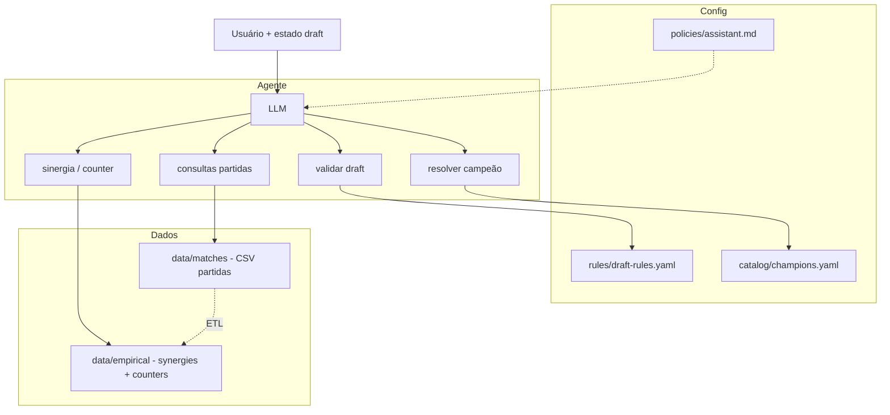

# Especificação do agente (implementação)

Documento único para montar o orquestrador, tools e dados. **Atualize o diagrama abaixo** quando a arquitetura mudar.

## Diagrama



## Fluxo

1. Entrada: mensagem + **estado do draft** (JSON normalizado).
2. Prompt: políticas (`policies/assistant.md`) + trecho compacto das regras (`rules/draft-rules.yaml`).
3. Tools: validação e nomes contra YAML/catálogo; estatísticas e partidas **só via tool** (não carregar JSON/CSV inteiro no prompt).

## Estado do draft (contrato sugerido)

```json
{
  "side": "blue",
  "phase": "ban_1",
  "banned": ["Skarner"],
  "picked": [{ "champion": "Azir", "role": "mid" }]
}
```

Ajuste campos ao `rules/draft-rules.yaml` do produto.

---

## Camada 1 — Config

| Caminho | Uso |
|---------|-----|
| `rules/draft-rules.yaml` | Mecânica do draft; validação determinística (fases, bans/picks, roles). |
| `policies/assistant.md` | Comportamento, limites (ex.: não inventar winrate), tom. |
| `catalog/champions.yaml` | Nomes/ids/aliases alinhados a dados e ETL. |

---

## Camada 2 — Agregados (sinergia / counter)

**Arquivos:** `data/empirical/synergies.jsonl`, `counters.jsonl` (ou `.json` array — um formato por ambiente).

**Linha:** `champion1`, `champion2`, `winrate`, `games`.

**Semântica:** documentar no código do ETL e repetir na descrição da tool — sinergia e counter usam os mesmos campos; a ordem pode importar no counter. Sinergia costuma ser coocorrência no mesmo time; counter, vitória do lado de `champion1` vs presença de `champion2` no adversário (confirmar no seu pipeline).

**Regras de uso no agente**

- Toda consulta com `min_games` (ex.: ≥10).
- Resposta estruturada com `games` e `winrate` para o modelo citar a amostra.

**Tools**

| Tool | Parâmetros | Retorno |
|------|------------|---------|
| `empirical_synergy` | `champion`, `min_games`, `top_k` | Pares no mesmo time. |
| `empirical_counter` | `champion`, `min_games`, `top_k` | Métrica de “counter” do ETL. |
| `empirical_pair` | `champion_a`, `champion_b`, `relation` | Um par, se existir. |

**Metadados do export (recomendado):** `generated_at`, `source`, opcional `min_games_used_in_export`.

---

## Camada 3 — Partidas (uma linha = um jogo)

**Ordem das colunas (CSV):**

`gameid,top_blue,jng_blue,mid_blue,bot_blue,sup_blue,top_red,jng_red,mid_red,bot_red,sup_red,result`

- `result`: **`1`** = vitória **azul**, **`0`** = vitória **vermelho**.

**Tools:** consultas **parametrizadas** (evitar SQL livre do LLM), ex.:

- composição exata (5 campeões + lado + opcional vitória);
- vitória do lado que contém campeão X em rota Y (ou qualquer rota);
- amostra limitada de partidas.

Devolver sempre **contagens** (e período/torneio do dataset, quando existir).

**Armazenamento:** CSV no início; depois SQLite/Postgres ou tabela normalizada `match_participant` se precisar de performance.

---

## Tools (visão única)

| Tool | Fonte |
|------|--------|
| `validate_draft_state` | `rules/draft-rules.yaml` |
| `resolve_champion` | `catalog/champions.yaml` |
| `empirical_synergy` / `empirical_counter` / `empirical_pair` | `data/empirical/*` |
| `matches_*` (parametrizadas) | `data/matches/*` |

---

## ETL

Partidas (`data/matches`) → job batch → `synergies` + `counters` versionados. Agente em runtime lê só agregados + responde comps via Camada 3.

## Datasets grandes

Git LFS, release ou path ignorado; documentar onde obter o arquivo.
